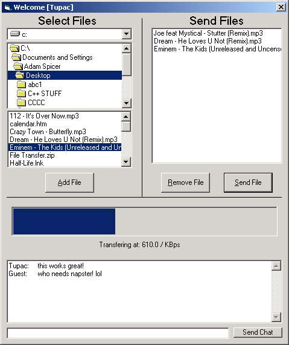



## SEND FILES over a network or the internet using WINSOCK  \|commented well\|

### Description

Last month i uploaded the wrong files for this project and everyone was telling me it looked nothing like the screenshot. lol...

well i fixed it and uploaded the CORRECT source! With this project, you can send multiple files over a network with ease. I have not had the chance to test it over the internet yet, so please leave feedback if you have tried it! Enjoy and vote!
 
### More Info
 

             |
---                |---
**Submitted On**   |2001-02-25 18:36:26
**By**             |[AdamSpicer](https://github.com/Planet-Source-Code/PSCIndex/blob/master/ByAuthor/adamspicer.md)
**Level**          |Intermediate
**User Rating**    |4.5 (27 globes from 6 users)
**Compatibility**  |VB 6\.0
**Category**       |[Internet/ HTML](https://github.com/Planet-Source-Code/PSCIndex/blob/master/ByCategory/internet-html__1-34.md)
**World**          |[Visual Basic](https://github.com/Planet-Source-Code/PSCIndex/blob/master/ByWorld/visual-basic.md)
**Archive File**   |[CODE\_UPLOAD15883342001\.zip](https://github.com/Planet-Source-Code/adamspicer-send-files-over-a-network-or-the-internet-using-winsock-commented-well__1-21502/archive/master.zip)

